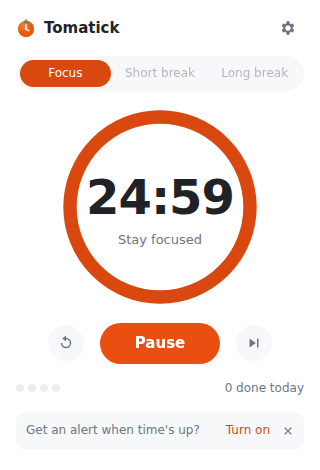
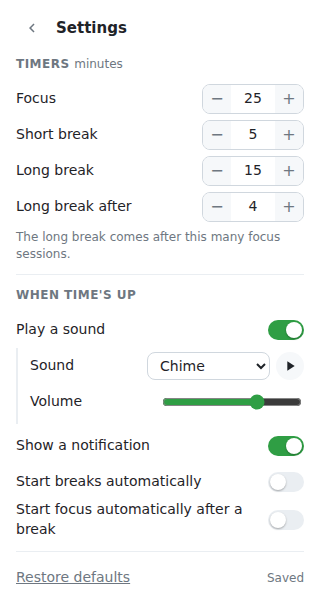

# Tomatick

**Tomatick: Pomodoro Focus Timer** is a simple, customizable Pomodoro timer for Chrome. It defaults to the classic
technique: 25-minute focus sessions, 5-minute short breaks, and a 15-minute
long break after every 4 sessions. All of that is adjustable. Sound and
notification alerts are available but off until you turn them on.

<p>
  
  
</p>

## Features

- One-click start, pause, restart, and skip. Press **Space** in the popup to start or pause.
- Click **Focus**, **Short break**, or **Long break** to jump to that timer.
- A countdown badge on the toolbar icon. It turns into a ✓ when a timer ends.
- Optional alerts when time's up: a sound (bell, chime, or digital beep, with volume) and/or a desktop notification.
- Optional auto-start for breaks and for focus sessions.
- A count of focus sessions done today, and dots showing progress toward the long break.
- **Alt+Shift+P** opens the popup.
- Follows your system's light or dark theme.

## Development

Requires Node 22.22.3+ (or 24+) and Chrome 120+.

```bash
npm install
npm run build     # builds the extension into dist/
npm test          # unit and component tests (Vitest)
npm run watch     # rebuilds on change
npm run package   # builds and writes tomatick-<version>.zip for the Web Store
```

### Load it in Chrome

1. Open `chrome://extensions`.
2. Turn on **Developer mode** (top right).
3. Click **Load unpacked** and choose the `dist/` folder.
4. Pin the Tomatick icon from the puzzle-piece menu so the badge is visible.

After a rebuild, click the reload arrow on the extension's card. The popup
picks up changes the next time you open it, but the background worker only
updates on reload.

## How it works

Think of the background service worker as a kitchen timer sitting on the
counter, and the popup as you glancing at it. Closing the popup doesn't stop
the timer. Chrome also "puts the counter away" (shuts the worker down) when
it's idle, so the timer never counts down in memory. Instead it writes down
_when_ the timer ends and asks Chrome to wake it at that moment.

| Path                           | What it is                                                                                                                                                                                                                               |
| ------------------------------ | ---------------------------------------------------------------------------------------------------------------------------------------------------------------------------------------------------------------------------------------- |
| `src/shared/timer.ts`          | The pure timer state machine (start, pause, reset, next phase). No `chrome.*` calls, so it's easy to test.                                                                                                                               |
| `src/background/background.ts` | The service worker. Owns the timer state in `chrome.storage.local`, schedules a `chrome.alarms` alarm for the end time, updates the badge, and fires the alerts. Catches up on browser startup if a timer ended while Chrome was closed. |
| `src/offscreen/offscreen.ts`   | Service workers can't play audio, so the worker opens a hidden [offscreen document](https://developer.chrome.com/docs/extensions/reference/api/offscreen) to play the alert sound.                                                       |
| `src/shared/sounds.ts`         | The alert sounds, synthesized with the Web Audio API (no audio files).                                                                                                                                                                   |
| `src/popup/`                   | The Angular popup. `PomodoroStore` mirrors storage into signals and sends commands to the worker; `TimerView` and `SettingsView` are the two screens.                                                                                    |
| `public/`                      | `manifest.json`, icons, and the small static pages, copied into `dist/` as-is.                                                                                                                                                           |
| `scripts/build.mjs`            | Runs `ng build` for the popup, then esbuild for the worker and offscreen script.                                                                                                                                                         |

Settings are saved to `chrome.storage.sync`, so they follow your Chrome profile.

## Publishing to the Chrome Web Store

The extension only asks for permissions Chrome shows no install warning for,
with no host permissions, remote code, network requests, or data collection,
which keeps review straightforward.

1. Bump `version` in `package.json` (the build copies it into the manifest).
2. Run `npm run package` and upload the zip it writes.
3. Register at the [Chrome Web Store Developer Dashboard](https://chrome.google.com/webstore/devconsole) (one-time $5 fee).
4. Listing assets: at least one 1280x800 screenshot, a 440x280 promo tile, and the 128px icon (`public/icons/icon-128.png`).
5. Privacy tab: use [PRIVACY.md](PRIVACY.md). Single purpose: "A Pomodoro timer that alternates focus sessions and breaks." Permission justifications:
   - `alarms`: wake the extension when a focus session or break ends.
   - `notifications`: show the optional "time's up" notification.
   - `offscreen`: play the optional "time's up" sound, since service workers can't play audio.
   - `storage`: remember the timer and the user's settings.
