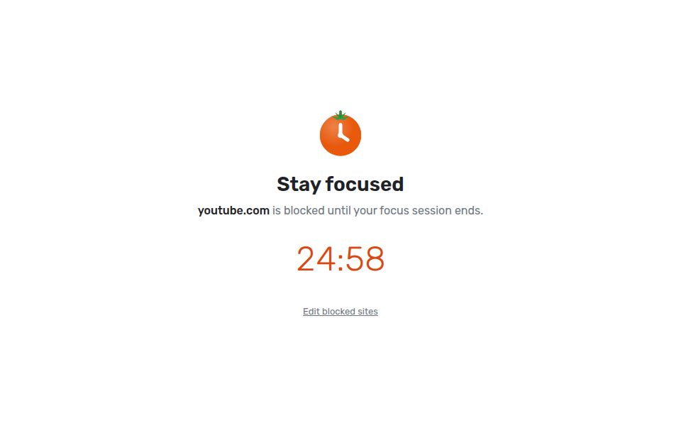

# Tomatick

**Tomatick: Focus Timer** is a simple, customizable focus timer for Chrome, based on the
Pomodoro Technique®. It defaults to the classic technique: 25-minute focus sessions, 5-minute short breaks, and a 15-minute
long break after every 4 sessions. All of that is adjustable. Sound and
notification alerts and a site blocker are available but off until you turn
them on.

<p>
  
  
</p>

## Features

- One-click start, pause, restart, and skip. Press **Space** in the popup to start or pause.
- Click **Focus**, **Short break**, or **Long break** to jump to that timer.
- A countdown badge on the toolbar icon. It turns into a ✓ when a timer ends.
- Optional alerts when time's up: a sound (bell, chime, or digital beep, with volume) and/or a desktop notification.
- Optional auto-start for breaks and for focus sessions.
- A count of focus sessions done today, and dots showing progress toward the long break.
- **Alt+Shift+P** opens the popup.
- An optional site blocker: during focus sessions, sites on your list (YouTube, Reddit, and friends) show a "stay focused" page instead, with the time left. Breaks and pauses unblock them.
- Follows your system's light or dark theme.
- A **Help** screen (the ? in the popup) with a quick how-to, a contact address, and links to the privacy policy, terms of use, and credits.

<p>
  
</p>

## Built with Claude

Tomatick is a portfolio project, designed and built by Jon Poltorak working with
[Claude Code](https://claude.com/claude-code), Anthropic's AI coding assistant.
Claude wrote most of the code, tests, and docs from plain-language requests,
and each change landed as a reviewed pull request; the
[pull request history](https://github.com/jtpoltorak/tomatick/pulls?q=is%3Apr+is%3Aclosed)
shows how it came together.

It's free, open source ([MIT](LICENSE)), and will stay that way. It's meant
for anyone who finds focus hard, including people with ADD or ADHD: a timer
that stays simple, quiet by default, and out of the way.

## Development

Requires Node 22.22.3+ (or 24+) and Chrome 120+.

```bash
npm install
npm run build     # builds the extension into dist/
npm test          # unit and component tests (Vitest)
npm run watch     # rebuilds on change
npm run package   # builds and writes tomatick-<version>.zip for the Web Store
```

### Load it in Chrome

1. Open `chrome://extensions`.
2. Turn on **Developer mode** (top right).
3. Click **Load unpacked** and choose the `dist/` folder.
4. Pin the Tomatick icon from the puzzle-piece menu so the badge is visible.

After a rebuild, click the reload arrow on the extension's card. The popup
picks up changes the next time you open it, but the background worker only
updates on reload.

## Web app

The same timer also builds as a web app: an installable, offline-capable PWA
with the same screens, settings, and sounds. It's a static site, so it can be
hosted for free on GitHub Pages.

```bash
npm run start:web   # dev server at http://localhost:4200 (no service worker)
npm run build:web   # builds the static site into dist-web/
```

To preview the production build, serve `dist-web/` with any static server,
for example `npx serve dist-web`.

What's different on the web:

- **No site blocker.** A web page can't change what other tabs load, so the
  Settings screen points to the extension instead.
- **No toolbar badge or Alt+Shift+P.** The tab's title shows the time left instead.
- **The page has to stay open** (in any tab, even a background one). Closing it
  doesn't lose your place: the timer catches up when you open it again, but
  alerts only fire while it's open.
- **Notifications ask first.** Turning them on asks for the browser's permission.

### Deploying to Railway

The web app's real home is on [Railway](https://railway.com), behind a
Cloudflare domain. The repo carries everything Railway needs:

- [Dockerfile](Dockerfile) builds `dist-web/` with Node, then serves it with
  [Caddy](https://caddyserver.com) on Railway's `$PORT`.
- [Caddyfile](Caddyfile) adds compression, security headers (a strict
  Content-Security-Policy, since the app makes no outside requests), and cache
  rules: pages and scripts are rechecked on every visit so updates show up
  right away, while icons and fonts are cached for a week.
- [railway.json](railway.json) tells Railway to use the Dockerfile and to
  redeploy only when files that affect the web app change.

One-time setup:

1. In Railway, create a new project → **Deploy from GitHub repo** →
   `tomatick`. Railway reads `railway.json` and builds from `main` on every
   push.
2. In the service's **Settings → Networking**, click **Generate Domain** to
   check it on a `*.up.railway.app` address.
3. Still in **Networking**, click **Custom Domain** and enter your domain.
   Railway shows a `CNAME` and a `TXT` record; add both in Cloudflare's
   **DNS** tab (Cloudflare flattens the `CNAME` at the root domain, so the
   bare domain works). Either proxy setting works; if the record is proxied
   (orange cloud), set Cloudflare's **SSL/TLS** mode to **Full**, not
   **Full (strict)**.

To try the production server locally: `docker build -t tomatick-web . && docker run -p 8080:8080 tomatick-web`,
then open http://localhost:8080.

### Deploying to GitHub Pages

[.github/workflows/pages.yml](.github/workflows/pages.yml) builds `dist-web/`
and publishes it on every push to `main`. It needs a one-time switch: in the
repository's **Settings → Pages**, set **Source** to **GitHub Actions**. The
app is then at `https://<user>.github.io/tomatick/`.

## How it works

Think of the background service worker as a kitchen timer sitting on the
counter, and the popup as you glancing at it. Closing the popup doesn't stop
the timer. Chrome also "puts the counter away" (shuts the worker down) when
it's idle, so the timer never counts down in memory. Instead it writes down
_when_ the timer ends and asks Chrome to wake it at that moment.

| Path                           | What it is                                                                                                                                                                                                                                                       |
| ------------------------------ | ---------------------------------------------------------------------------------------------------------------------------------------------------------------------------------------------------------------------------------------------------------------- |
| `src/shared/timer.ts`          | The pure timer state machine (start, pause, reset, next phase). No `chrome.*` calls, so it's easy to test.                                                                                                                                                       |
| `src/background/background.ts` | The service worker. Owns the timer state in `chrome.storage.local`, schedules a `chrome.alarms` alarm for the end time, updates the badge, and fires the alerts. Catches up on browser startup if a timer ended while Chrome was closed.                         |
| `src/offscreen/offscreen.ts`   | Service workers can't play audio, so the worker opens a hidden [offscreen document](https://developer.chrome.com/docs/extensions/reference/api/offscreen) to play the alert sound.                                                                               |
| `src/shared/blocker.ts`        | Site blocker helpers: cleaning up typed sites and deciding when to block. The worker turns a [declarativeNetRequest](https://developer.chrome.com/docs/extensions/reference/api/declarativeNetRequest) redirect rule on during focus sessions and off otherwise. |
| `src/blocked/blocked.ts`       | The "stay focused" page blocked sites redirect to. It shows the time left and offers a link back once the session ends.                                                                                                                                          |
| `src/shared/about.ts`          | The author name, support email, copyright year, and legal "last updated" date shown on the Help screen and legal page. Change them here; `npm run package` warns if the placeholders ever come back.                                                             |
| `public/legal.html`            | The privacy policy, terms of use, and credits page, opened from Help. [PRIVACY.md](PRIVACY.md) and [TERMS.md](TERMS.md) carry the same text for the Web Store; change them together.                                                                             |
| `src/shared/sounds.ts`         | The alert sounds, synthesized with the Web Audio API (no audio files).                                                                                                                                                                                           |
| `src/popup/`                   | The Angular popup. `PomodoroStore` mirrors storage into signals and sends commands to the worker; `TimerView` and `SettingsView` are the two screens.                                                                                                            |
| `public/`                      | `manifest.json`, icons, and the small static pages, copied into `dist/` as-is.                                                                                                                                                                                   |
| `scripts/build.mjs`            | Runs `ng build` for the popup, then esbuild for the worker and offscreen script.                                                                                                                                                                                 |

Settings are saved to `chrome.storage.sync`, so they follow your Chrome profile.

The web app reuses all of this except the Chrome-only parts. The popup's UI
only talks to a `TimerHost` (`src/popup/app/timer-host.ts`): in the extension
that's `ChromeTimerHost`, which messages the background worker; in the web app
it's `WebTimerHost` (`src/web/web-timer-host.ts`), which runs the same timer
logic in the page with `localStorage`, a `setTimeout` for the end time, the
browser's Notification API, and the same synthesized sounds.

## Publishing to the Chrome Web Store

At install, the extension only asks for permissions Chrome shows no install
warning for. The site blocker's access to sites is an optional permission
Chrome asks for only when someone turns the blocker on, and it's handed back
when they turn it off. There's no remote code, network requests, or data
collection, which keeps review straightforward.

1. Keep "Pomodoro" out of the extension's name and store title: Pomodoro® is a registered trademark of Francesco Cirillo, whose [trademark guidelines](https://www.pomodorotechnique.com/pomodoro-trademark-guidelines/) don't allow it in product names. Describing the technique is fine with the ® and the not-affiliated note (see Help and `legal.html#credits`).
1. If your name or support email changes, update `src/shared/about.ts`, `PRIVACY.md`, and `TERMS.md` together.
1. Bump `version` in `package.json` (the build copies it into the manifest).
1. Run `npm run package` and upload the zip it writes.
1. Register at the [Chrome Web Store Developer Dashboard](https://chrome.google.com/webstore/devconsole) (one-time $5 fee). Add tomatick.support@gmail.com as the account's contact email (it's shown on the listing and can be changed later; the sign-in account can't). Turn on 2-step verification for the Google account, and declare yourself a **non-trader** (you're an individual, not a business).
1. Fill in the Store listing, Privacy practices, and Distribution tabs from [store/LISTING.md](store/LISTING.md), which has the description, category, permission justifications, privacy answers, and the screenshots and promo tiles in [store/images](store/images). Regenerate the images with `node scripts/store-images.mjs` after UI changes.
